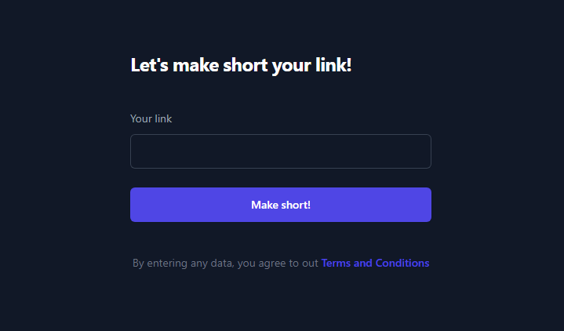
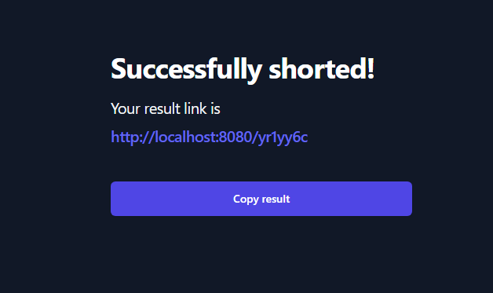

## | `shortly`
Very simple, beautiful and handy link shortener. You can get an instance of this service up on your server in five minutes!

### | `How to setup on my host?`
You need to have installed Java 17, Screens, Wget.
1) Navigate to your installation directory:
> cd [PATH]
2) Download Shortly:
> wget https://github.com/dynomake/shortly/releases/latest/download/shortly.zip
3) Unzip Shortly:
> unzip shortly.zip
4) Change the settings in the config file `application.yml` to your settings.
5) Make the start file executable with
> chmod +x start.sh
6) One last step! Just launch the app:
> sh start.sh

### | `Screenshots:`

### | `Donations`:
If you want to support my pet-projects and open-source projects, you always can send me crypro to my USDC wallet address on POLYGON network: `0xAE8840E02C52F4a289af083465d78C2329E6ca7B`